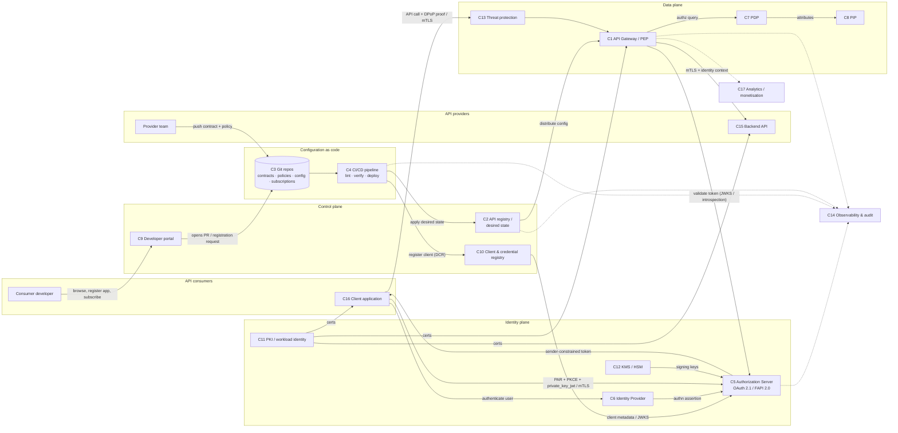

# 01 — Reference architecture: zero-trust API management

## Design principles

1. **Zero trust** — no implicit trust from network location; every call is authenticated,
   sender-constrained and authorised per request (NIST SP 800-207).
2. **OAuth 2.1 baseline, FAPI 2.0 Security Profile where the data is sensitive** —
   PKCE, PAR, `private_key_jwt` or mTLS client authentication, sender-constrained
   access tokens (DPoP or mTLS-bound), no implicit/ROPC grants, short-lived tokens.
3. **Configuration as code** — Git is the single source of truth for APIs, policies,
   gateway configuration and consumer subscriptions; the control plane is only ever
   written to by pipelines.
4. **Contract first** — OpenAPI/AsyncAPI documents are the unit of design, lint,
   review, deployment and consumer discovery.
5. **Separation of planes** — control plane (management), data plane (enforcement),
   identity plane (tokens/credentials) and observability plane are separately
   deployable and independently scalable.

## Components (system elements)

| # | Component | Role (one line) | Zero-trust / FAPI contribution |
|---|---|---|---|
| C1 | **API Gateway / Policy Enforcement Point (PEP)** | Data-plane proxy that terminates TLS, validates tokens, enforces policies, rate limits and routes to backends. | Verifies signature, `aud`, `exp`, scope and **sender constraint** (DPoP proof / mTLS cert thumbprint) on every request. |
| C2 | **Control plane / API registry** | Stores the *desired state* of APIs, routes, policies, plans and subscriptions; distributes it to gateways. | Reconciles from Git (GitOps); human write access disabled; every state change is a signed commit. |
| C3 | **Git repositories (source of truth)** | API contracts, policy-as-code, gateway config, consumer subscriptions, environment overlays. | Immutable audit trail, code review, branch protection, signed commits. |
| C4 | **CI/CD pipeline** | Lints contracts and policies, runs policy verification (conftest/OPA), security tests, then deploys to control plane. | Only identity permitted to write to C2; pipeline uses workload identity, not shared secrets. |
| C5 | **Authorization Server (AS)** | OAuth 2.1 / OIDC issuer: PAR, PKCE, client authentication, token issuance, introspection, revocation, DPoP, mTLS-bound tokens. | Implements the FAPI 2.0 Security Profile; publishes discovery + JWKS; key rotation. |
| C6 | **Identity Provider (IdP)** | Authenticates end users (MFA, federation, e-ID). May be the same product as C5 but is a distinct function. | Strong user authentication feeding the AS; supports step-up. |
| C7 | **Policy Decision Point (PDP)** | Fine-grained, attribute/relationship-based authorisation (e.g. OPA/Rego, Cedar) evaluated per request by C1. | Moves authorisation out of the backend; policies are code in C3. |
| C8 | **Policy Information Point (PIP)** | Supplies attributes to the PDP (consents, entitlements, data classification, risk score). | Enables consent- and context-aware decisions. |
| C9 | **Developer portal** | Self-service catalogue for API consumers: discover, subscribe, register apps, sandbox access, docs generated from contracts. | Portal writes nothing directly — it opens a pull request / registration request that is approved and applied as code. |
| C10 | **Client & credential registry** | Registered OAuth clients, their JWKS/certificates, redirect URIs, allowed grants; Dynamic Client Registration (RFC 7591) with software statements. | Public keys only; private keys never leave the consumer. |
| C11 | **PKI & certificate lifecycle** | Issues/rotates/revokes client and server certificates for mTLS; short-lived certs for workloads (e.g. SPIFFE/SPIRE). | Workload identity for east-west traffic; certificate-bound tokens. |
| C12 | **Secrets & key management (KMS/HSM)** | Signing keys for the AS, gateway TLS keys, pipeline credentials. | Keys non-exportable; rotation without downtime; audit of key use. |
| C13 | **Threat protection** | WAF, bot/DDoS mitigation, schema/JSON validation, request size and rate limits — often a capability of C1. | Reduces attack surface before authorisation logic runs. |
| C14 | **Observability & audit** | Metrics, traces, structured logs and an append-only, tamper-evident **audit log** of who published/approved/subscribed/called what. | Non-repudiation; detection; evidence for assurance. |
| C15 | **API providers (backends)** | Business services exposing APIs; trust only calls from the gateway carrying a verified identity context. | Verify gateway identity (mTLS) and/or the propagated token; no direct exposure. |
| C16 | **API consumers (client applications)** | First/third-party apps holding a client key pair; obtain tokens from C5 and call C1. | Hold private keys; use PAR + PKCE + DPoP/mTLS. |
| C17 | **Analytics / monetisation (optional)** | Usage analytics, plans, quotas, billing. | Informational; must not be a bypass path. |

## System context diagram

## Trust boundaries

* **TB1 Internet → Data plane**: only C13/C1 are reachable. Everything requires a
  sender-constrained token; anonymous APIs are an explicit policy exception.
* **TB2 Data plane → Providers**: mTLS with workload identity; backends reject
  traffic not originating from the gateway identity.
* **TB3 Humans → Control plane**: read-only. All writes go through C3 → C4.
* **TB4 Pipeline → Control plane / Identity plane**: pipeline authenticates with its
  own workload identity; scopes limited per environment.

## Standards referenced

RFC 6749/6750 (OAuth 2.0), OAuth 2.1 (draft), RFC 7636 (PKCE), RFC 9126 (PAR),
RFC 9449 (DPoP), RFC 8705 (mTLS client auth & cert-bound tokens), RFC 7523
(`private_key_jwt`), RFC 7591/7592 (Dynamic Client Registration), RFC 8414
(AS metadata), RFC 9068 (JWT access tokens), RFC 7662 (introspection), RFC 7009
(revocation), FAPI 2.0 Security Profile & Message Signing, OpenID Connect Core,
OpenAPI 3.x / AsyncAPI, NIST SP 800-207, SPIFFE/SPIRE.
