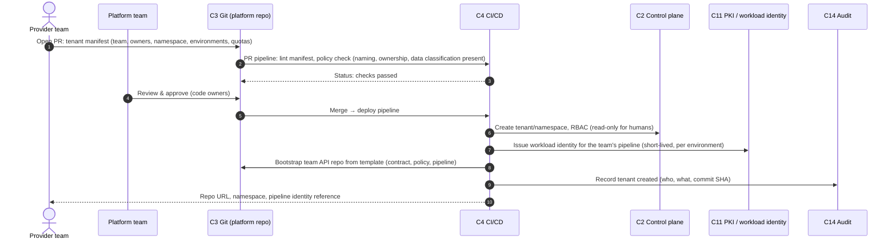
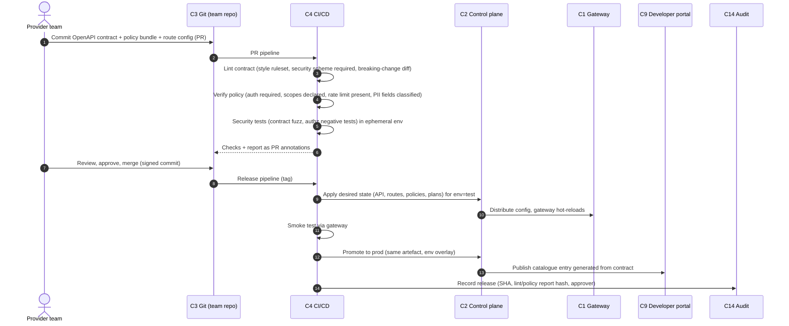
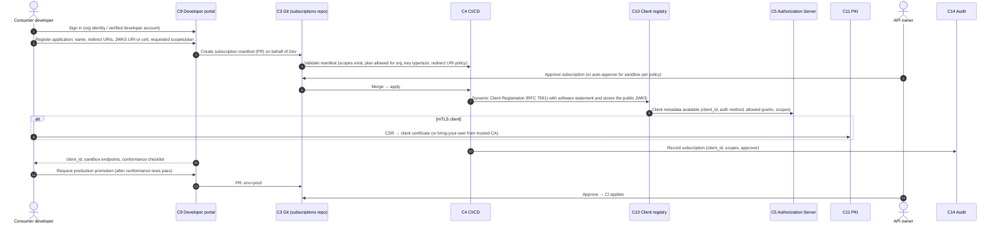
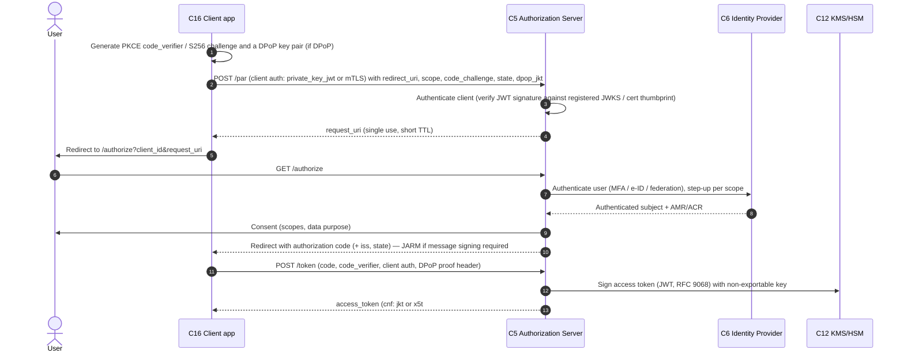
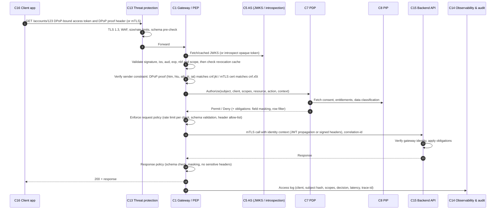
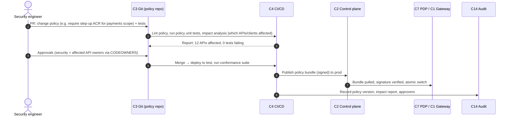
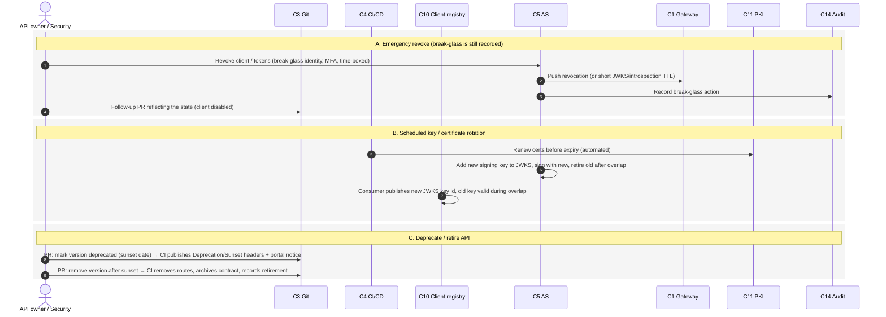

# 02 — Use cases and sequence diagrams

Each use case is a process the solution and its organisation
must support. Steps are numbered to match the diagrams; the *Requirement traces*
line links each use case to the baseline (see `requirements/`).

Component IDs (C1…C17) refer to `01-reference-architecture.md`.

---

## UC-01 Onboard an API provider (team) onto the platform

**Actors:** Provider team (PDev), Platform team, C3 Git, C4 CI/CD, C2 control plane, C11 PKI, C14 audit.
**Trigger:** A team wants to publish its first API.
**Outcome:** The team owns a repository, a pipeline identity and a namespace/tenant in the control plane; nothing was configured by hand.

| Step | Description | Control |
|---|---|---|
| 1 | Provider declares itself as code: a tenant manifest with owners, namespace, environments, default quotas and data-classification. | Manifest schema in repo. |
| 2 | PR pipeline validates the manifest against schema and platform policies (e.g. owners must be a group, classification mandatory). | Lint + policy-as-code. |
| 3–4 | Human review by platform team; approval is the only manual act. | Branch protection, CODEOWNERS. |
| 5–6 | Merge triggers deployment; the control plane receives the desired state and creates the tenant with human roles limited to read. | GitOps reconciliation. |
| 7 | The team's pipeline gets a workload identity scoped to its namespace and environment — no shared API keys. | PKI / SPIFFE. |
| 8 | A repository is bootstrapped from the golden template: sample contract, policy bundle, pipeline definition. | Template repo. |
| 9–10 | Audit event written; team receives its handles. | Tamper-evident audit. |

**Requirement traces:** SOL-CAC-001, SOL-CAC-002, SOL-ORG-001, IMPL-ORG-001, IMPL-CAC-001, IMPL-CAC-005.

---

## UC-02 Design, verify and publish an API (contract-first, CI/CD)

**Actors:** PDev, C3, C4, C2, C1, C9 portal, C14.
**Trigger:** New API version ready in the team repo.
**Outcome:** API deployed to gateway and visible in the portal, with lint and policy evidence attached to the release.

| Step | Description | Control |
|---|---|---|
| 1 | Contract, policies and routing are text files in the team repo; the contract is the API. | OpenAPI 3.x, policy DSL/YAML. |
| 3 | Lint enforces house style and security: every operation has a security scheme, scopes are defined, no free-form `string` for IDs, breaking changes require a major version. | e.g. Spectral ruleset in platform repo. |
| 4 | Policy verification evaluates the policy bundle against platform rules (Rego/Cedar tests, conftest): auth mandatory, JWT `aud` set, rate limit present, PII flagged. | Policy-as-code with unit tests. |
| 5 | Dynamic tests against an ephemeral gateway instance: negative authz tests (wrong scope, expired token, missing DPoP) must fail closed. | Test harness in template. |
| 7 | Merge requires green checks and approval; commit signing is mandatory. | Branch protection. |
| 9–12 | Deployment is a control-plane API call by the pipeline identity; gateways reload without downtime; a smoke test gates promotion. Same artefact goes to all environments. | GitOps, immutable artefacts. |
| 13 | Portal entry (docs, try-it, plans) is generated, never hand-edited. | Docs from contract. |
| 14 | Release record links commit SHA to evidence (lint & policy report hashes). | Assurance evidence. |

**Requirement traces:** SOL-LCM-001, SOL-LCM-002, SOL-LCM-004, SOL-CAC-001, SOL-POL-001, SOL-POL-002, IMPL-CAC-001, IMPL-CAC-002, IMPL-CAC-003, IMPL-CAC-006, IMPL-LCM-002, IMPL-POL-001.

---

## UC-03 Onboard an API consumer (application registration & subscription)

**Actors:** Consumer developer (Dev), C9 portal, C3, C4, C10 client registry, C5 AS, C11 PKI, API owner, C14.
**Trigger:** A developer wants access to a published API.
**Outcome:** A registered OAuth client (public key only on platform side), an approved subscription, sandbox then production access.

| Step | Description | Control |
|---|---|---|
| 1 | Developer identity is verified (organisation IdP or verified account); anonymous registration is not allowed. | IdP federation. |
| 2 | The app registers with a **public key** (JWKS URI or X.509). No client secrets for confidential clients in FAPI mode. | Key policy. |
| 3–6 | The portal does not write to the control plane; it commits a subscription manifest. Validation and approval happen as code review (auto-approval rules are themselves policy-as-code). | GitOps for subscriptions. |
| 7–8 | Pipeline performs DCR at the client registry; the AS learns the client's allowed grants (`authorization_code` + PKCE, `client_credentials`), auth method (`private_key_jwt` or `tls_client_auth`) and scopes. | RFC 7591/7592. |
| 9 | For mTLS, a client certificate is issued or trusted from an approved CA; the certificate is bound to the client_id. | RFC 8705. |
| 10–11 | Audit and hand-over; sandbox first. | |
| 12–14 | Promotion to production is a second approval; conformance test evidence (e.g. FAPI conformance suite results) attached. | Assurance. |

**Requirement traces:** SOL-DEVX-001, SOL-DEVX-002, SOL-DEVX-003, SOL-DEVX-004, SOL-SEC-004, SOL-SEC-010, SOL-CAC-003, IMPL-ORG-002, IMPL-SEC-002.

---

## UC-04 Authentication and token issuance (FAPI 2.0 authorization code flow)

**Actors:** End user, C16 client, C6 IdP, C5 AS, C10 registry, C12 KMS.
**Trigger:** Client needs an access token to call a protected API on behalf of a user.
**Outcome:** Short-lived, sender-constrained access token (and refresh token if allowed).

| Step | Description | FAPI 2.0 / OAuth 2.1 rule |
|---|---|---|
| 1 | PKCE with S256 is mandatory for all clients; DPoP key pair generated per client instance. | RFC 7636, RFC 9449. |
| 2–4 | Pushed Authorization Request: parameters never travel via the browser; client must authenticate at PAR. `dpop_jkt` binds the future token to the client's key. | RFC 9126. |
| 5–6 | Only `client_id` + `request_uri` are exposed on the front channel. | FAPI 2.0. |
| 7–8 | User authentication is delegated to the IdP; the AS records ACR/AMR for step-up decisions. | OIDC. |
| 9 | Consent records purpose and scopes; becomes an attribute for the PDP (via PIP). | Consent as data. |
| 10 | Code is bound to `iss` (RFC 9207) to prevent mix-up; optional JARM signs the response. | FAPI 2.0. |
| 11–13 | Token endpoint requires PKCE verifier, client authentication and a DPoP proof; the AS signs with an HSM-held key; access token carries the `cnf` claim. Refresh tokens rotate and are sender-constrained. | RFC 8705 / 9449. |

**Requirement traces:** SOL-SEC-001, SOL-SEC-012, SOL-SEC-002, SOL-SEC-003, SOL-SEC-011, SOL-SEC-005, SOL-DATA-001, SOL-DATA-004, PROC-SEC-001.

---

## UC-05 Data access — API call through the gateway (per-request zero trust)

**Actors:** C16 client, C13 threat protection, C1 gateway, C5 AS, C7 PDP, C8 PIP, C15 backend, C14 audit.

| Step | Description | Fail-closed behaviour |
|---|---|---|
| 1–3 | Every request carries a sender-constrained token; threat protection runs before any business logic. | Reject oversize, malformed, rate-exceeded. |
| 4–5 | Token validation is local (JWKS cached, rotated) with revocation awareness; `aud` must name this API. | 401 on any failure. |
| 6 | Proof-of-possession: DPoP proof must match method, URI, token hash and be fresh/unique; mTLS thumbprint must match token `cnf`. A replayed or stolen bearer is useless. | 401 `invalid_dpop_proof`. |
| 7–9 | Coarse authz (scope) at gateway, fine-grained authz at PDP with attributes from PIP; obligations can shape the response. | 403 on Deny. |
| 10–13 | Backend trusts only the gateway (mTLS) and receives a verified identity context; it never re-implements authentication. | Backend rejects non-gateway. |
| 14–16 | Response policy prevents data leakage; audit record supports non-repudiation and investigation. | |

**Requirement traces:** SOL-GW-001, SOL-GW-002, SOL-GW-004, SOL-SEC-002, SOL-SEC-006, SOL-SEC-009, SOL-OBS-001, SOL-DATA-002, SOL-DATA-003, IMPL-SEC-001, IMPL-DATA-002.

---

## UC-06 Change a policy (policy-as-code lifecycle)

**Actors:** Security/platform engineer, C3, C4, C2, C1/C7, C14.

**Requirement traces:** SOL-POL-001, SOL-POL-003, IMPL-POL-001, IMPL-POL-002, IMPL-ORG-003.

---

## UC-07 Revoke, rotate and decommission

**Actors:** API owner / security, C3, C4, C10, C5, C1, C11, C14.

**Requirement traces:** SOL-SEC-007, SOL-SEC-008, SOL-CAC-004, SOL-LCM-003, SOL-LCM-005, SOL-OPS-002, SOL-OPS-003, IMPL-SEC-003, IMPL-SEC-006, IMPL-OPS-001.
